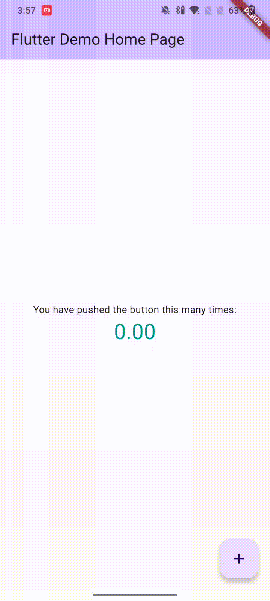

# Animated Counter Widget Flutter



## How to use

##### Add custom_animated_counter_widget.dart in your project
##### User AnimatedDigit instead of Text

```
AnimatedDigit(
  //Custom Key
  key: const Key("key"),
  
   // Digit you want to animate
  digit: _counter.toDouble(),
  
  //TextStyle of your View
  textStyle: 
    const TextStyle(
      fontSize: 30, 
      color: Colors.teal)
);
```
